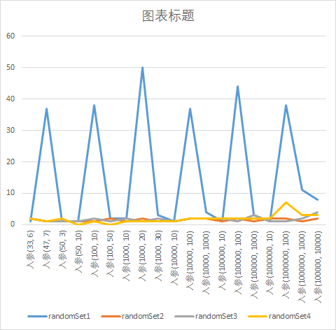
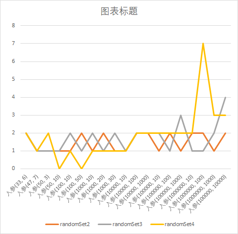
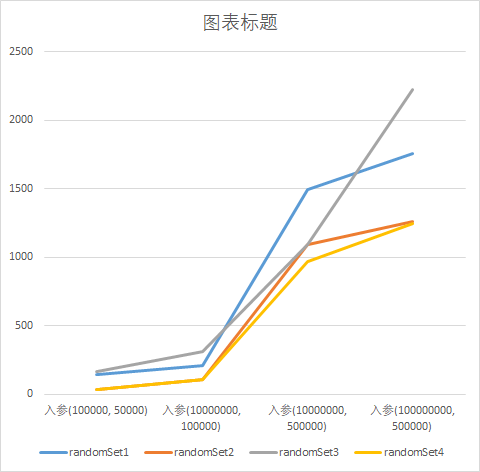

# 工程简介
因为在网上没找到较好的关于生成不重复随机算法分析较好的资料，因此自己创建了这个RandomSet 项目。此项目只是简单实现一些生成不重复随机数用于实现一些抽奖场景，例如双色球抽奖场景。（原创项目，绝无搬运，希望给颗小星星）
# 延伸阅读
 1. 在测试数据较小时，randomSet1的算法明显耗时较大，如图1所示：
> 
 2. 去掉性能较差的算法randomSet1的测试数据时，可以较明显看出其他三种算法在不同测试数据下的性能，如图2所示：
> 
 3. 把测试数据随机数范围和随机数个数也整大时，各算法性能如图3所示：
> 
# 结论
看图1和2发现在测试数据较小时，除了算法random1效率较差，其他三种算法效率较高且相差不大，其中random2效率较为稳定。看图3发现四种算法在随机数范围和随机数个数都较大的情况下，算法randomSet1和randomSet3效率较差，算法randomSet2和randomSet4效率较好，其中算法randomSet4性能略好于randomSet2。综上，没有最好的算法，只有根据场景选择合适的算法。